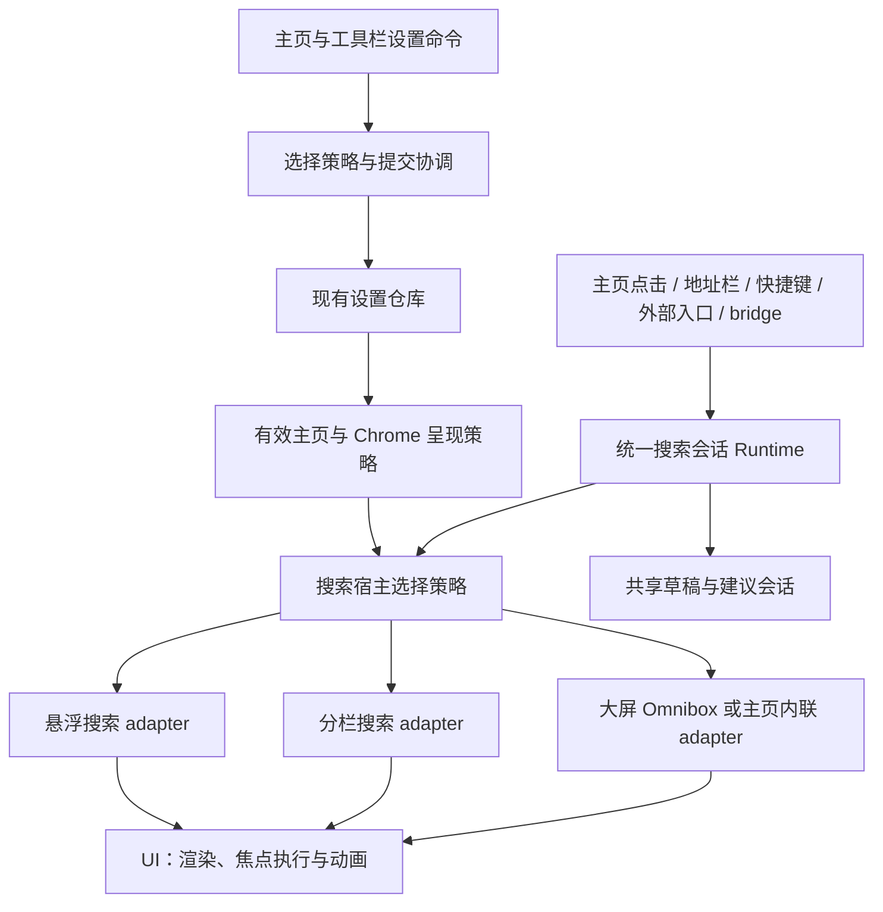

# 主页自定义、工具栏自定义与搜索呈现架构审查

- 审查日期：2026-09-28。
- 基准：`main`，HEAD `ba9634b1d213926302f0ecf43d9e16150880faa5`，以审查时工作区内容为准。
- 范围：三种系统主页的选择、两种工具栏的默认与覆盖、搜索入口与生命周期，以及相关持久化、同步和大屏交接边界。
- 方式：静态调用链审查、测试源码检索及独立复核。未运行测试、构建或设备验证，未抓取或检查界面。
- 本次只新增审查文档。工作区原有未提交修改已纳入阅读，包括 `BrowserShellPage.ets`、`BrowserSplitToolbarChrome.ets`、`BrowserSearchListSurfaceLayoutViewModel.ets`；没有修改业务代码。下文行号对应审查时工作区，后续编辑可能使行号变化。

## 0. 实施状态（2026-09-28 更新）

本节记录审查之后落地的改动，正文其它小节保留审查当时的结论与证据性质。

| 编号 | 状态 | 落地内容 |
| --- | --- | --- |
| F1 | 已实现 | 新增 `core/search/BrowserSearchInvocationHostPolicy.ets`（纯策略，按 shell／有效工具栏／场景选宿主）与 `core/search/BrowserSearchInvocationHostRouter.ets`（在 `present` 时选宿主，换宿主时 `suspend` 旧宿主并以同一 authority 重新呈现）。新增 `core/browser/BrowserSplitToolbarSearchInvocationAdapter.ets`。手机壳只注册该 router，快捷键、桌面卡片、应用快捷方式、bridge 与分栏地址行都经同一条 `Runtime.open` 路径。 |
| F2 | 已实现 | Escape、系统返回、取消、提交统一走 `Runtime.endCurrent`，分栏关闭由 adapter 的 `end` 触发；`releaseAddressFocus` 只做浮动宿主清理。键盘事实新增 `searchInvocationVisible`。 |
| F3 | 已实现 | 分栏编辑写入 `Runtime.updateCurrentDraft` 与建议会话；跨 shell 用 `BrowserSearchInvocationSessionCoordinator.refreshPresentation()` 在同一会话内换呈现宿主，保留草稿与光标。 |
| F4 | 已实现 | 关闭引入代次（`shouldCompleteSearchClose`）：无动画关闭直接 `reset`；有动画关闭在 `animateTo` 回调立即进入终态，`onFinish` 仅作兜底，过期回调不会清理随后新开的搜索；并加了同一次关闭的防重入。协调器在通知 surface adapter 之前先退休会话，避免 `end → 释放地址焦点 → end` 的重入递归（悬浮工具栏关闭时的闪退）。 |
| F5 | 未改动 | 选主页的多仓库提交与失败恢复仍待处理。 |
| D1 | 未改动 | 「默认」覆盖生命周期保持现状，未改数据模型。 |

测试与验证：

- 新增 `entry/src/test/BrowserSearchInvocationHostPolicy.test.ets`：宿主选择策略、关闭代次，以及带假 adapter 的会话契约（宿主切换后同会话换宿主且保留草稿、隐藏宿主不呈现、只结束匹配 authority、会重入 `end()` 的适配器只触发一次）。已注册进 `entry/src/test/List.test.ets`。
- 架构护栏与主工程 ArkTS 编译通过（`scripts/check-architecture-guardrails.sh`；community 未签名构建与 Official 调试构建均可编译）。
- **`ohosTest` 目前无法编译**，因此 hypium 测试暂不可运行：`entry/src/test/HuaweiAgcSdkLoader.test.ets`、`entry/src/ohosTest/ets/test/UserScriptValueFileAdapterConformance.test.ets`、`entry/src/test/BrowserArkWebMediaTakeoverRecoveryCharacterization.test.ets` 存在与本次改动无关的既有错误。本次新增的测试文件未产生新增错误。
- 未做设备行为验收；焦点、输入法与共享元素动画的时序仍需在实际设备上确认。

## 1. 审查结论

三种主页的默认工具栏映射和用户手动覆盖通路已经存在，六种组合也有相应的本地搜索入口。当前最主要的架构问题是：**分栏搜索没有完整接入已有的统一搜索会话体系**。它自行管理打开、草稿和关闭，统一搜索入口却继续指向手机底部搜索宿主，导致同一个“打开搜索”意图因入口不同而走向不同状态。

建议保留两种搜索界面的视觉差异，统一它们的会话所有权、入口分发与结束契约；主页布局不应决定搜索会话的业务实现。

| 编号 | 优先级 | 发现 | 证据性质 |
| --- | --- | --- | --- |
| F1 | P1 | 分栏模式下，快捷键、桌面卡片、应用快捷方式和第三方主页 bridge 的搜索请求仍路由到底部宿主 | 静态确认路由错配；可见表现待运行验证 |
| F2 | P2 | Escape 只清旧地址栏状态，没有关闭分栏搜索 | 静态确认收尾遗漏 |
| F3 | P2 | 分栏本地搜索未进入 Runtime，跨 shell 无法通过统一会话机制接续草稿 | 静态确认会话交接缺口 |
| F4 | P2 | 分栏取消进入 `closing` 后，缺少由本次关闭自身保证的最终 `reset` | 静态确认终态缺口；后续事件可能补偿 |
| F5 | P2 | 选择主页由多个独立存储提交组成，后续失败会留下部分生效状态 | 静态确认失败恢复风险；未注入故障 |
| D1 | 产品规则 | 更换主页是否重置用户选过的工具栏，需要明确并固定为契约 | 当前行为明确，但不能据此判定需求违背 |

P1 表示应优先修复的主要入口问题；P2 表示应随后修复的一致性和恢复问题。本次没有发现足以判定为 P0 的证据。

## 2. 产品语义与现状

### 2.1 三种主页与两种工具栏是两个可独立选择的维度

用户所说的“默认主页”，当前代码与选项名称是“经典主页”。[SystemHomepageStyleCatalog][catalog] 第 19–45 行定义了以下映射：

| 主页 | 内部值 | 选择该主页时写入的工具栏 | 用户能否另选工具栏 |
| --- | --- | --- | --- |
| 默认／经典主页 | `classic` | `floating`（悬浮） | 可以改为 `split` |
| 简约主页 | `centered` | `split`（上下分栏） | 可以改为 `floating` |
| 极简主页 | `minimal` | `split`（上下分栏） | 可以改为 `floating` |

当前实现的“默认”是**选择另一主页时执行一次的设置写入**，并非每次渲染时都强制推导。工具栏设置随后直接修改全局 `appearance.toolbarChromeStyle`，不会反向改变主页样式。这一点支持用户需要的自由组合，应保留。

[SystemHomepageSelectionService][selection] 第 35–39 行的调用顺序为：

```text
切回系统主页（清除 selectedItemId）
  → 写入 homePageStyle
  → 写入此主页默认的 toolbarChromeStyle
  → 确保主页设置恢复入口可用
```

系统主页设置页与新用户引导复用该选择服务。工具栏覆盖经 [BrowserToolbarCustomizationCoordinator][toolbar-settings] 第 87–95 行独立写入。

### 2.2 六种组合的搜索呈现

下表限定普通手机浏览场景，从主页本地入口发起搜索。它描述静态代码路径，不代表已做六组设备验收。

| 主页 × 工具栏 | 本地搜索入口 | 进入的搜索界面 |
| --- | --- | --- |
| 经典 × 悬浮 | 底部地址面板 | 悬浮底部输入与搜索列表 |
| 经典 × 分栏 | 顶部主页地址行 | 分栏顶部输入与全高搜索内容 |
| 简约 × 悬浮 | 主页中央搜索框，转发至悬浮工具栏 | 悬浮底部输入与搜索列表 |
| 简约 × 分栏 | 主页中央搜索框；静止顶部主页地址行隐藏 | 带主页搜索框过渡动效的分栏搜索界面 |
| 极简 × 悬浮 | 主页中央搜索框，转发至悬浮工具栏 | 悬浮底部输入与搜索列表 |
| 极简 × 分栏 | 主页中央搜索框或保留的顶部主页地址行 | 共用分栏搜索组件；中央入口另带主页过渡状态 |

证据：[BrowserShellPage][shell] 第 9730–9855 行、[BrowserSplitToolbarChrome][split] 第 661–805、842–879 行，以及 [HomeContentSections][home-content] 第 89、226–265 行。

现有 `shouldRouteCenteredHomeSearchToFloatingToolbar()` 已让“简约／极简 + 悬浮”进入正确的悬浮搜索通路，不需要重新发明这条路由。

还需保留以下范围区别：

- 工具栏样式不只影响主页，也影响普通网页上的地址入口与搜索呈现。
- 大屏 shell 使用其自身导航与 Omnibox；简约／极简主页还存在内联搜索。手机的六格矩阵不能直接当作大屏规则。
- 文档、阅读器、小说阅读和沉浸状态参与 Chrome 可见性判定，不能只根据持久化的 `toolbarChromeStyle` 判断某个搜索宿主当前可用。
- 第三方主页的逐主页搜索显示开关，与全局工具栏样式是不同设置。bridge 发起的临时搜索不应改写持久偏好。

### 2.3 当前数据所有权

| 状态 | 当前所有者 | 主要观察与使用方式 |
| --- | --- | --- |
| 系统主页样式及内容展示开关 | `HomePagePresentationSettingsRepository` | 独立 Preferences 存储，发布 AppStorage |
| 全局工具栏样式 | `PreferencesRepository.appearance` | 外观存储与变更通知 |
| 当前第三方主页及逐主页偏好 | `CustomHomepageRepository` | 主页选择与 presentation profile |
| 统一搜索身份、场景、草稿及恢复 | `BrowserSearchInvocationSessionCoordinator` | window 范围 Runtime 与 surface adapter |
| 分栏搜索的开启和输入 | `BrowserSplitToolbarChrome` + Shell | 本地 `searching/query`、回调及请求版本号 |
| 建议查询及建议快照 | `BrowserSearchSuggestionCoordinator` | 被统一搜索与分栏本地链路共同使用 |

这些所有者并非都需要合并。主要问题是分栏组件和 Shell 同时承担了本应由统一会话拥有的状态，且持久化的多项设置缺少统一提交边界。

### 2.4 持久化、同步与恢复

主页样式与工具栏样式存放在不同仓库。`PersonalizationSyncSnapshotService` 构造快照时，将二者同时导出至 `core_preferences.appearance`；应用时又分别更新外观仓库和主页展示仓库，见 [同步快照服务][sync] 第 556–638、1328–1409 行。

当前同步行为值得保留：

- 有效的非默认组合，例如 `centered + floating`，可以作为两个实际值导出和恢复。
- 输入缺少 `toolbarChromeStyle` 时保留本地工具栏值，缺少 `homePageStyle` 时保留本地主页值。
- 恢复快照没有调用 `selectSystemHomepageStyle()`，因此不会因恢复主页字段而强行覆盖快照里的工具栏选择。
- 同步主页布局不会通过这个方法清除本机第三方主页选择；导入主页文件与系统主页样式不是同一个同步对象。

不能在后续重构时，将“用户点击选主页”和“恢复已有配置”都接到会重置工具栏的同一命令。若以后扩展覆盖来源模型，必须同时设计旧快照缺字段规则和兼容读取，不能凭“工具栏值等于默认值”推断用户没有显式选择。

## 3. 具体发现与修改意见

### F1 · P1：统一搜索入口没有按当前工具栏选择可见宿主

**触发条件：**手机 shell 使用分栏工具栏，用户通过 Ctrl+L／Alt+D、桌面搜索卡片、应用搜索快捷方式，或已通过授权检查的第三方主页 `openSearch` 请求搜索。

**代码证据：**

- [BrowserSearchInvocationRuntime][runtime] 第 118–127 行：`connectForShell()` 仅按手机／大屏选择 adapter，没有分栏路径。
- [BrowserShellPage][shell] 第 5055–5057、10089–10102、11495–11503 行：快捷键、bridge 进入 Runtime，手机注册 `BrowserShellSearchInvocationAdapter`。桌面卡片与快捷方式见 [EntryAbility][entry] 第 761–771 行。
- [BrowserShellSearchInvocationAdapter][phone-adapter] 第 71–101 行：`present()` 准备并提交底部面板计划。
- [BrowserShellPage][shell] 第 7655–7658 行：分栏时为底部面板设置 `restingChromeSuppressed`。
- [BrowserBottomAddressPanel][floating] 第 785–786、1215–1220、2536–2539、2967–2970 行：该状态使其不可见、不可交互、不可聚焦，并拒绝或清除聚焦请求。
- [BrowserShellPage][shell] 第 8888–8915 行：分栏本地打开只处理本地状态和建议，并没有从统一请求接管呈现。

**影响：**统一入口和用户直接点击分栏地址行走向不同宿主。网页场景可能已返回 `committed`，但没有打开可见的分栏搜索；主页场景可能提交给隐藏宿主，也可能因宿主准备失败而结束。具体焦点、键盘和超时表现需运行验证，不能将所有场景描述为必然超时。

**修改建议：**在现有 surface adapter 契约下补充分栏呈现适配。用统一策略结合 shell、有效工具栏和场景选择宿主；所有本地与外部入口都先创建统一搜索会话。`committed` 至少应确认所选可见宿主已就绪并接纳该呈现请求。不要在每个入口分别增加一段 `if (split)`。

### F2 · P2：Escape 未进入分栏的关闭通路

**触发条件：**直接打开分栏搜索后，在没有更高优先级的页内查找、全屏或标签页列表拦截时按 Escape。

**代码证据：**[BrowserKeyboardShortcutCoordinator][keyboard] 第 333–357 行通过地址焦点调用释放操作；[BrowserShellPage][shell] 第 5065–5081 行的手机回调只释放旧地址焦点、草稿或 detent，没有调用 `dismissSplitToolbarSearch()` 或增加其 dismiss version。分栏组件的本地 `searching` 因而没有通过这条路径关闭。

**影响：**共享焦点状态已经退出，分栏搜索页面仍可能保持开启；提示与实际呈现不一致。

**修改建议：**在会话所有者提供统一的结束命令，将 Escape、返回键、取消映射到明确的结束原因，再交给当前 adapter 收尾。避免输入组件自行关闭一半、Shell 再清另一半。

**排除误报：**系统返回键已有补偿。[BrowserShellBackCoordinator][back] 第 88–95 行产生 `dismiss_search_invocation`，[BrowserShellPage][shell] 第 3283–3287 行显式执行分栏 dismiss。因此不能把系统返回键和 Escape 一并判定为没有接线。

软键盘隐藏应另行定义语义：若只失焦，应保留搜索会话和草稿；若退出，应走完整结束命令。[BrowserRootAddressInputSessionCoordinator][input-session] 的现有底部地址结束计划不包含分栏本地状态，不能自然承担这两种语义的协调。

### F3 · P2：分栏搜索草稿未进入统一会话，跨 shell 缺少交接

**触发条件：**从没有活动 Runtime 搜索会话的状态开始，直接打开分栏搜索并输入，再在同一窗口、同一活动标签下切换到大屏 shell。

**代码证据：**[BrowserSplitToolbarChrome][split] 第 661–667 行更新本地 `query/searching`；[BrowserShellPage][shell] 第 8888–8915 行把文本写入 Shell，并用固定 `'split-toolbar-search'` 管理建议。该链路没有 Runtime `open()` 或 `updateCurrentDraft()`。与此相对，[BrowserSearchInvocationSessionCoordinator][session] 第 254–420 行的 adapter 交接和恢复，仅针对其拥有的活动会话及草稿。

**影响：**已有统一恢复机制无法接续这次分栏搜索。Shell 中可能仍有文本，但它不是 Runtime 当前会话，不能据此保证新宿主恢复输入、选择范围或焦点。组件卸载后重建也没有同等恢复保证。

**修改建议：**复用 F1 的适配改造，让 Runtime 拥有一次搜索的唯一身份和规范草稿；组件上报编辑，呈现状态由会话投影得到。尺寸变化只替换呈现宿主，同一标签的会话保留；活动标签变化继续按现有上下文失效规则结束。

**范围限制：**query 并非只留在组件，它已写入 Shell 和建议协调器。也不能断言所有前后台切换都会丢失，组件未卸载时可能保持本地状态。此问题是统一交接契约缺失。

### F4 · P2：取消后的最终关闭状态依赖后续事件补偿

**触发条件：**分栏搜索取消或返回关闭后，没有后续提交、主页重置或有效的键盘隐藏确认流程执行最终清理。外接键盘或未弹出软键盘应作为重点验证场景。

**代码证据：**

- [BrowserSplitToolbarChrome][split] 第 754–777 行先清本地搜索，再通知 Shell 或反向动画。
- [BrowserShellPage][shell] 第 8888–8897、9802–9822 行调用 `beginClosingOverlay()`；反向动画结束仅清理挂载标记，没有保证最终 `reset()`。
- [BrowserSearchSuggestionCoordinator][suggestions] 第 264–269 行将会话设为 inactive，却发布 `homeSearchOverlayVisible=true` 并保留建议。
- [BrowserShellPage][shell] 第 9190–9192 行仍把 overlay 标记计入 `homeSearchSessionActive`。

**影响：**组件已关闭，共享状态仍表示处于搜索展示过程。该状态可能继续影响主页呈现判定；不能单凭这一标记断言屏幕上必然永久残留可见遮罩。

**修改建议：**无过渡动画的关闭直接进入 `closed/reset`；有动画时明确 `closing → closed`，由携带会话身份／版本的动画完成回调做最终清理。组件卸载和取消动画也要有终止策略。过期回调不能清掉随后新开的搜索。

**已有补偿：**键盘隐藏确认、提交建议、地址提交或主页瞬态重置可以执行 reset。建议协调器也会阻止已结束会话的旧异步结果继续发布。问题在于一次取消本身不保证终态，而不是这些补偿都不存在或旧请求必然回填。

### F5 · P2：主页选择缺少跨仓库的提交与失败恢复边界

**触发条件：**选择另一系统主页，前序写入成功后，工具栏持久化或设置恢复入口修正等后续步骤失败。

**代码证据：**[SystemHomepageSelectionService][selection] 第 35–39 行连续执行独立写入，无回滚；[HomePagePresentationSettingsRepository][home-repository] 第 69–82 行先更新内存，再存储和发布；[PreferencesRepository][preferences] 第 775–783 行先更新缓存，再等待写入。设置页 [CustomHomepageSettingsScreen][home-settings] 第 1496–1520 行捕获失败后提示并刷新，不恢复前序已提交状态。

**影响：**一次“选择主页”可能已经清除第三方主页选择、切换布局，但工具栏或恢复入口未完成；内存与持久化状态也可能不一致。独立通知允许消费者观察中间组合，但本次未证明必然出现肉眼可见闪烁或将中间快照上传。

**修改建议：**保留现有选择服务作为应用层入口，先计算包含主页、工具栏和恢复入口的完整目标配置，再协调提交。根据现有存储能力，选择单一聚合提交或具有明确恢复行为的多仓库提交记录；只有持久化结果一致后，才统一发布应用层可观察的完成状态。若采用补偿，需覆盖补偿失败和重启恢复。

批量通知只能避免消费者观察中间态，不能单独解决存储半成功；同样不能只把缓存回滚就声称实现了事务。同步／本地备份恢复中的相关多仓库应用也应复用提交边界，但保留它们不同的合并和默认规则。

**排除误报：**设置页已有 `busy` 和“当前主页不重复选择”的短路，不能据此声称连续点击必然产生并发写入。

## 4. D1：先明确“默认”的覆盖生命周期

当前行为可以用以下场景准确描述：

```text
选择经典主页 → 自动写入悬浮
用户改成分栏 → 保存并使用分栏
再次点击当前经典主页卡片 → 短路，不重置
选择简约主页 → 再次写入该主页默认的分栏
用户改成悬浮，再选择极简主页 → 重新写入分栏
```

这实现了“每次选另一主页应用默认，之后允许自由修改”。用户此次要求并未明确跨主页是否保留覆盖，不能把重置本身判为 bug，也不应仅因为缺少 `auto` 字段就要求扩展数据模型。

| 可选规则 | 推荐的数据语义 | 代价与适用条件 |
| --- | --- | --- |
| 维持当前行为：更换主页应用其默认，之后可修改 | 保留两个实际值，在选择命令中明确一次性默认写入 | 改动最小，需在设置说明和契约测试中固定重置时机 |
| 用户显式选择后，跨主页保持 | `follow_home_default` 或显式 `floating/split` 偏好，再派生有效样式 | 需要“恢复跟随默认”入口和旧数据迁移；不要与大屏暂时覆盖混为一谈 |
| 每种主页分别记忆工具栏 | 按系统主页样式保存覆盖；无覆盖时使用目录默认 | 状态与同步更复杂，仅在明确需要逐主页记忆时采用 |

近期建议按当前语义修复 F1–F5，不把可选的产品规则调整混进搜索架构修复。若改用跟随默认或逐主页记忆，旧数据应保守保留当前实际组合，不能猜测用户历史操作意图。

## 5. 建议的职责边界



此图是建议结构。优先扩展已有 Runtime、adapter 和 core owner，不要求按图新建一批服务。

- **主页目录／选择策略**负责默认映射、显式设置语义与目标配置计算。恢复快照使用恢复语义，不触发用户选主页的默认重置。
- **Chrome 呈现策略**综合持久偏好、shell、主页／网页和阅读等场景，投影有效工具栏与可用搜索宿主。大屏或沉浸造成的临时呈现变化不回写用户偏好。
- **搜索会话所有者**管理 authority、scene、draft、selection、来源和结束原因。尽量复用现有模型；避免固定字符串会话与 Runtime 会话并行存在。
- **呈现 adapter**承接 `present/suspend/end`，处理草稿投影及宿主交接。大屏内联搜索也应明确纳入统一会话或由明确策略互斥，避免借用分栏标志隐式代表另一种搜索。
- **UI 组件**保留输入、焦点、几何动效等本地展示状态，但不拥有第二份长期独立的业务会话。Shell 订阅最终状态和转发事件，减少其中的路径选择和关闭编排。

共享元素动画可以继续由 UI 执行；需要移到 core 的是“打开哪个会话、何时算关闭、切换宿主如何恢复”等策略。两种界面不必强行合并成同一个巨型组件。

## 6. 分阶段修改顺序

| 阶段 | 建议工作 | 完成标准 |
| --- | --- | --- |
| 1：统一入口 | 实现分栏 adapter 与宿主选择；分栏点击也进入 Runtime | 任意入口在有效分栏模式都打开分栏搜索，悬浮模式保持原有呈现 |
| 2：统一生命周期 | 规范 draft 更新、Escape／返回／取消／提交、动画终态和跨 shell 交接 | 同一会话只有一个所有者；关闭无残留，旧回调不能干扰新会话 |
| 3：设置提交 | 为选主页及恢复相关字段提供一致提交与失败恢复边界 | 成功后配置完整生效，失败与重启后状态可解释且可恢复 |
| 4：固定产品规则 | 将 D1 选定规则写入产品说明及契约；必要时再迁移 schema | 切主页、重启、同步与备份恢复的覆盖行为一致 |

阶段 1、2 应作为同一轮功能修复协同推进，避免仅让外部入口接通，而本地编辑、取消和恢复仍停留在旧状态链。无需以全量重写 `BrowserShellPage` 为前提。

## 7. 建议验证与验收矩阵

现有 [SystemHomepageStyleCatalog.test.ets][catalog-test] 第 29–68 行覆盖三种主页、卡片激活与默认映射；[BrowserToolbarChromeStylePolicy.test.ets][policy-test] 第 29–71 行覆盖分栏启用、悬浮抑制、预留空间与中央搜索分流。其余策略测试还覆盖滚动及大屏 Omnibox 的局部行为。

这些测试源码能证明已有局部契约，不能替代入口到会话结束的集成验证。本次在 `entry/src/test` 和相关 `scripts/check*` 的检索中，未定位到直接覆盖下表完整场景的断言；不等同于断言仓库完全没有其他相关测试。本次没有执行这些测试。

| 验收组 | 必须覆盖的输入／动作 | 应验证的结果 |
| --- | --- | --- |
| 六种组合 | 三主页 × 两工具栏，从主页入口打开 | 目标宿主匹配有效工具栏；主页过渡动效不改变会话语义 |
| 普通网页 | 两工具栏点击地址行 | 正确预填和选择网页地址；提交使用同一草稿 |
| 外部入口 | 分栏与悬浮下分别使用快捷键、桌面卡片、应用快捷方式、bridge | 打开可见宿主；bridge 保留文档授权校验；不修改主页显示偏好 |
| 完整结束 | 取消、Escape、系统返回、输入提交、建议点击、跨应用搜索 | 按动作完成导航或取消；会话、焦点、建议和呈现进入一致终态 |
| 键盘策略 | 软键盘收起、外接键盘、键盘未弹出 | 不依赖必然到达的键盘事件清理；失焦与退出语义明确 |
| 动画竞态 | 取消过程中重开搜索、动画期间切标签或切宿主 | 旧动画回调不能清理新会话，无残留 overlay |
| 宿主交接 | 同标签手机／大屏切换，组件卸载重建 | 按约定保留草稿及选择范围，或明确结束；不能保持“激活但无可见宿主” |
| 设置默认与覆盖 | 按 D1 选定规则切主页、改工具栏、重复点当前卡片、重启 | 默认只在规定时机应用，用户覆盖不被渲染或恢复流程擅自重置 |
| 同步与备份 | 六种组合往返、旧快照缺任一字段、本机选着第三方主页 | 有效组合保持，缺字段行为确定，设备本地第三方选择边界不被误改 |
| 提交失败 | 各持久化阶段及恢复入口修正失败，失败后重启 | 无不可解释的半提交；修复／回滚结果符合明确契约 |
| 场景例外 | 阅读、小说、文档、沉浸，以及显示／隐藏系统搜索 | 选择策略识别实际可用宿主；隐藏的 Chrome 不被当作成功呈现目标 |

后续实现时，优先增加纯策略表驱动断言与带假 adapter 的会话契约验证，检查可观察行为，而非仅检查代码中存在某个函数名。ArkUI 焦点、输入法、共享元素动画及真实尺寸切换再通过适当的运行环境验证。本次未据代码推测这些平台事件的实际先后顺序。

分栏工具栏的硬边几何已单独建立契约：`node scripts/check-aira-split-toolbar-frame-contract.cjs` 直接加载 `BrowserToolbarChromeStylePolicy`，断言网页预留量始终不小于对应行的实际绘制高度（包括状态栏被滚动隐藏、地址行仍显示的组合），并检查壳层与分栏组件从同一组策略常量取行高和预留。它证明的是判定与依赖关系，真机上的动画连贯性仍需复测。

## 8. 审查边界与不应破坏的现有能力

- 保留三种主页 × 两种工具栏的自由组合；不要将非默认组合视为非法值并归一化回默认。
- 保留简约／极简覆盖悬浮时已有的中央搜索转发，以及系统返回键已有的分栏关闭逻辑。
- 保留两类搜索共享建议能力和列表布局的已有复用；`BrowserSearchListSurfaceLayoutViewModel` 的布局共用不能替代会话共用。
- 保留第三方主页逐项偏好的隔离与临时搜索不改持久偏好的约束，参见 [Custom Homepage System Chrome Architecture](custom-homepage-system-chrome-architecture.md)。
- 不将“多文件”“大组件”本身当作缺陷；本报告的建议以可定位的路由、状态和提交边界问题为依据。
- 本文不构成性能、安全或所有自定义主页功能的完整审计，也未验证设备上最终画面。本轮重点覆盖用户指定的主页／工具栏组合与搜索协作。

[catalog]: ../AiraBrowser/entry/src/main/ets/core/customhome/SystemHomepageStyleCatalog.ets
[selection]: ../AiraBrowser/entry/src/main/ets/core/customhome/SystemHomepageSelectionService.ets
[toolbar-settings]: ../AiraBrowser/entry/src/main/ets/core/browser/BrowserToolbarCustomizationCoordinator.ets
[shell]: ../AiraBrowser/entry/src/main/ets/app/pages/BrowserShellPage.ets
[split]: ../AiraBrowser/entry/src/main/ets/app/components/browser/BrowserSplitToolbarChrome.ets
[home-content]: ../AiraBrowser/entry/src/main/ets/app/components/browser/HomeContentSections.ets
[sync]: ../AiraBrowser/entry/src/main/ets/services/sync/PersonalizationSyncSnapshotService.ets
[runtime]: ../AiraBrowser/entry/src/main/ets/app/runtime/BrowserSearchInvocationRuntime.ets
[entry]: ../AiraBrowser/entry/src/main/ets/app/abilities/EntryAbility.ets
[phone-adapter]: ../AiraBrowser/entry/src/main/ets/core/browser/BrowserShellSearchInvocationAdapter.ets
[floating]: ../AiraBrowser/entry/src/main/ets/app/components/browser/BrowserBottomAddressPanel.ets
[keyboard]: ../AiraBrowser/entry/src/main/ets/core/browser/BrowserKeyboardShortcutCoordinator.ets
[back]: ../AiraBrowser/entry/src/main/ets/core/browser/BrowserShellBackCoordinator.ets
[input-session]: ../AiraBrowser/entry/src/main/ets/core/browser/BrowserRootAddressInputSessionCoordinator.ets
[session]: ../AiraBrowser/entry/src/main/ets/core/search/BrowserSearchInvocationSessionCoordinator.ets
[suggestions]: ../AiraBrowser/entry/src/main/ets/core/browser/BrowserSearchSuggestionCoordinator.ets
[home-repository]: ../AiraBrowser/entry/src/main/ets/data/preferences/HomePagePresentationSettingsRepository.ets
[preferences]: ../AiraBrowser/entry/src/main/ets/data/preferences/PreferencesRepository.ets
[home-settings]: ../AiraBrowser/entry/src/main/ets/app/components/customhome/CustomHomepageSettingsScreen.ets
[catalog-test]: ../AiraBrowser/entry/src/test/SystemHomepageStyleCatalog.test.ets
[policy-test]: ../AiraBrowser/entry/src/test/BrowserToolbarChromeStylePolicy.test.ets
